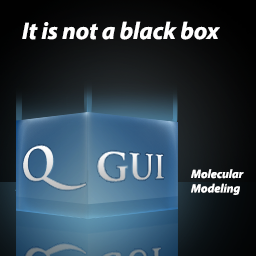

# Geir Villy Isaksen

I have a *Ph.D* in computational molecular sciences, but back in 2005 when I started at UiT the Arctic University of
Norway, I knew little about the "*computational*" part. Thus, starting out I thought I was heading down the experimentalist road. 
However, once I first became familiar with molecular modeling, both my interests and my academic path started shifting. 
I did my Masters degree in chemistry (2008-2010), which was 50/50 experimental and theoretical work. However, I must admit 
that I have not set foot in a wet-lab ever since. During my Ph.D (2010-2015) I did only theoretical work, and my 
interests in coding, graphical deign and software development awoke. 

## Summary & key skills
- TODO

### Relevant keywords 
- Python
- Virtual environment
- Anaconda / Conda
- Qt
- PyQt
- Bash
- CSS
- HTML
- Markdown
- Github / Gitlab / Git
- Tkinter
- Objective-C
- Javascript
- MAC OS
- Linux
- Stackoverflow
- Adobe Photoshop
- Adobe Illustrator
- PERL
- FORTRAN

## Software development

### Qgui 

### QresFEP / Qgui 2.0 

### *chem*REACT

### appNRIS

### cliNRIS

## Web pages & graphical design

Websites with HTML/CSS/JS have not been what I have spent the most time on throughout the years. But, besides the page that 
we are on right now, I have once upon a time also created and/or contributed to these sites:
- [Playmol](https://isaksengeir.github.io/playmol)
  - I created this site more or less from scratch (html/css). It served online **2012 - 2013**.
  - [View source @ github](https://github.com/isaksengeir/playmol/tree/master)
- [Brandsdal Group](https://isaksengeir.github.io/brandsdal_group/)
  - This is a site I made for my Ph.D supervisor's research group in **2014** and maintained it up until around **2016**.
  - [View source @ github](https://github.com/isaksengeir/brandsdal_group/tree/master)
- [CUBE3](https://site.uit.no/cube/)
  - All graphical design created by me - webpage created with [WordPress](https://wordpress.com/)
- [The Norwegian academic high-performance computing and storage services](https://documentation.sigma2.no/#the-norwegian-academic-high-performance-computing-and-storage-services)
  - Joint collaboration between UiT, UiO, UiB, NTNU and UNINETT Sigma2 where I have contributed particularly to the the 
  software / application documentation of [Schrödinger](https://documentation.sigma2.no/software/application_guides/schrodinger/schrodinger.html?highlight=schrodinger#)

    
## Publications

- [19]	**Isaksen, Geir Villy**; Guo, Xiaohu; Söderholm, Annika; Kunchugal P, Sandesh; Warsi, Omar; Eckhard, Ulrich; Trigüs, Silvia; Gogoll, Adolf; Jerström-Hultqvist; Åqvist, Johan; Andersson, Dan I; Selmer, Maria.
    [Structure and mechanism of a phage-encoded SAM lyase revises catalytic function of enzyme family.](https://elifesciences.org/articles/61818) *eLife* (2021); DOI: 10.7554/eLife.61818

- [18]	Socan, Jaka; **Isaksen, Geir Villy**; Brandsdal, Bjørn Olav; Åqvist, Johan.
    [Towards rational computational engineering of psychrophilic enzymes.](https://www.nature.com/articles/s41598-019-55697-4) *Scientific Reports Nature Research* (2019); DOI 10.1038/s41598-019-55697-4

- [17]	Jespers, Willem; **Isaksen, Geir Villy**; Andberg, Tor A.H.; Vasile, Silvana; Veen, Amber van; Åqvist, Johan; Brandsdal, Bjørn-Olav; Guitérrez de Terán, Hugo.
    [QresFEP: an automated protocol for the free energy calculation of protein mutations in Q.](https://pubs.acs.org/doi/10.1021/acs.jctc.9b00538) *J. Chem. Theory Comput.* (2019); DOI: 10.1021/acs.jctc.9b00538

- [16] 	Socan, Jaka; Kazemi, Masoud; Isaksen, **Geir Villy; Brandsdal**, Bjørn Olav; Åqvist, Johan. 
    [Catalytic adaptation of psychrophilic elastase.](https://pubs.acs.org/doi/10.1021/acs.biochem.8b00078) *Biochemistry* (2018); DOI 10.1021/acsbiochem.8b00078

- [15]	Åqvist, Johan; **Isaksen, Geir Villy**; Brandsdal, Bjørn Olav.
    [Computation of enzyme cold adaptation.](https://www.nature.com/articles/s41570-017-0051) *Nature Reviews Chemistry* (2017); DOI 10.1038/s41570-017-0051

- [14]	Michetti, Davide; Brandsdal, Bjørn Olav; Bon, Davide; **Isaksen, Geir Villy**; Tiberti, Matteo; Papaleo, Elena.
    [A comparative study of cold- and warm-adapted endonuclease A using sequence analyses and molecular dynamics simulations.](https://journals.plos.org/plosone/article?id=10.1371/journal.pone.0169586) *PLoS ONE* (2017); DOI 10.1371/journal.pone.0169586

- [13]	Åqvist, Johan; Kazemi, Masoud; **Isaksen, Geir Villy**; Brandsdal, Bjørn Olav.
[Entropy and enzyme catalysis.](https://pubs.acs.org/doi/10.1021/acs.accounts.6b00321) *Accounts of Chemical Research* (2017); DOI 10.1021/acs.accounts.6b00321

- [12] 	**Isaksen, Geir Villy**; Brandsdal, Bjørn Olav; Åqvist, Johan.
    [Thermodynamics of the purine nucleoside reaction revealed by computer simulations.](https://pubs.acs.org/doi/10.1021/acs.biochem.6b00967) 	*Biochemistry* (2016) ;doi: 10.1021/acs.biochem.6b00967

- [11]	**Isaksen, Geir Villy**
[Is enzyme design becoming less fiction and more science?](https://www.mn.uio.no/hylleraas/english/about/CTCC/annual-reports/2015.pdf) *CTCC – Annual report 2015* (2016); s. 8-9

- [10]	**Isaksen, Geir Villy**; Brandsdal, Bjørn Olav; Åqvist, Johan. 
[Enzyme surface rigidity tunes the temperature dependence of catalytic rates.](https://www.pnas.org/content/113/28/7822.short) *Proceedings of the National Academy of Sciences of the United States of America* (2016); Volum 113.(28) s. 7822-7827

- [9]	**Isaksen, Geir Villy**; Hopmann, Kathrin Helen; Åqvist, Johan; Brandsdal, Bjørn Olav. 
[Computer Simulations reveal substrate specificity of glycosidic bond cleavage in native and mutant human purine nucleoside phosphorylase.](https://pubs.acs.org/doi/10.1021/acs.biochem.5b01347) Biochemistry (2016); Volum 55. s. 2153-2162

- [8]	**Isaksen, Geir Villy**. 
[Datasimuleringer baner vei for enzymdesign.](http://www.kjemidigital.no/magasiner/kjemi-4-2015/) NKS - Kjemi (2015); Volum 4. s. 4-7

- [7]	**Isaksen, Geir Villy**. 
[Protein dynamics regulates enzyme enthalpy-entropy balance.](https://munin.uit.no/handle/10037/8177?show=full) UiT The Arctic University of Norway (2015); (ISBN 978-82-8236-178-1) 65 s.

- [6]	**Isaksen, Geir Villy**; Andberg, Tor Arne Heim; Åqvist, Johan; Brandsdal, Bjørn Olav. 
[Qgui: A high-throughput interface for automated setup and analysis of free energy calculations and empirical valence bond simulations in biological systems.](https://pubmed.ncbi.nlm.nih.gov/26080356/) *Journal of Molecular Graphics and Modelling* (2015); Volum 60. s. 15-23

- [5]	**Isaksen, Geir Villy**; Åqvist, Johan; Brandsdal, Bjørn Olav. 
[Protein surface softness is the origin of enzyme cold-adaptation of trypsin.](https://journals.plos.org/ploscompbiol/article?id=10.1371/journal.pcbi.1003813) *PloS Computational Biology* (2014); DOI 10:e1003813.(8)

- [4]	Karstad, Rasmus Tørnes; **Isaksen, Geir Villy**; Wynendaele, Evelien; Guttormsen, Yngve; De Spiegeleer, Bart; Brandsdal, Bjørn Olav; Svendsen, John Sigurd; Svenson, Johan. 
[Targeting the S1 and S3 Subsite of Trypsin with Unnatural Cationic Amino Acids Generates Antimicrobial Peptides with Potential for Oral Administration.](https://pubmed.ncbi.nlm.nih.gov/22720778/) *Journal of Medicinal Chemistry* (2012); Volum 55.(14) s. 6294-6305

- [3]	Flaten, Gøril Eide; Kottra, Gabor; Stensen, Wenche; **Isaksen, Geir Villy**; Karstad, Rasmus Tørnes; Svendsen, John Sigurd; Daniel, Hannelore; Svenson, Johan. 
[In Vitro Characterization of Human Peptide Transporter hPEPT1 Interactions and Passive Permeation Studies of Short Cationic Antimicrobial Peptides.](https://pubmed.ncbi.nlm.nih.gov/21401113/) *Journal of Medicinal Chemistry* (2011); Volum 54.(7) s. 2422-2432

- [2]	**Isaksen, Geir Villy**
[Flexible membrane active antimicrobial tripeptides with stability towards chymotryptic degradation.](https://munin.uit.no/handle/10037/2641?locale-attribute=en) UiT The Arctic University of Norway (2010)

- [1]	Karstad, Rasmus Tørnes; **Isaksen, Geir**; Brandsdal, Bjørn Olav; Svendsen, John Sigurd; Svenson, Johan. 
[Unnatural Amino Acid Side Chains as S1, S1 ', and S2 ' Probes Yield Cationic Antimicrobial Peptides with Stability toward Chymotryptic Degradation.](https://pubs.acs.org/doi/10.1021/jm1006337) *Journal of Medicinal Chemistry* (2010); Volum 53.(15) s. 5558-5566

